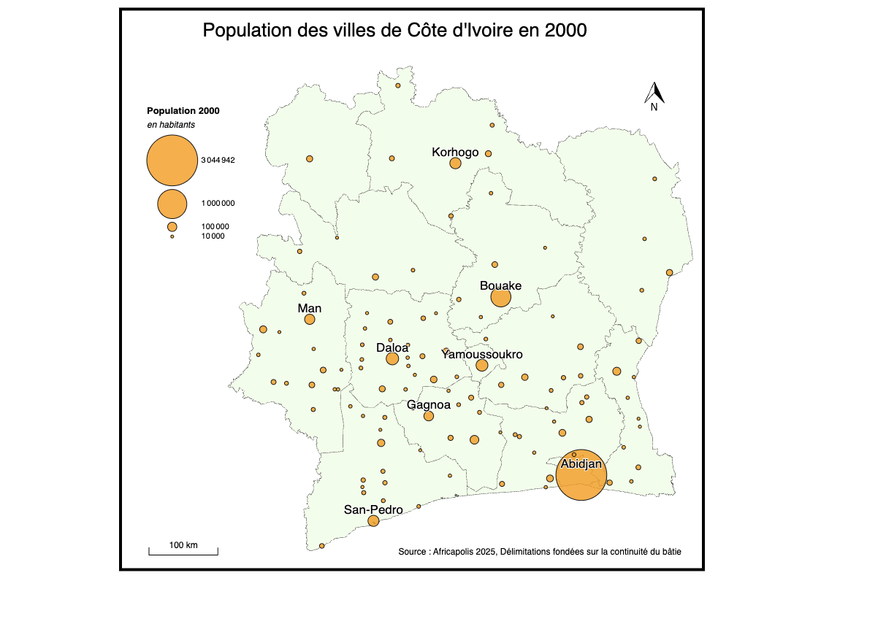
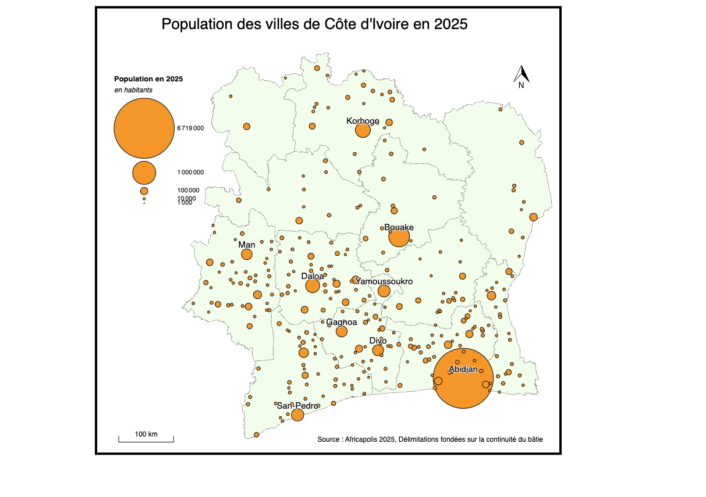
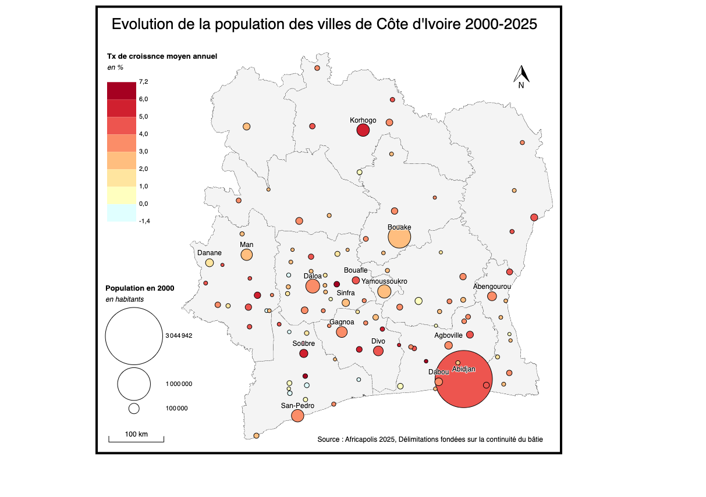

```{r}
library(knitr)
library(sf)
library(mapsf)
library(dplyr)
library(ggplot2)
library(ggrepel)
```


::: {.callout-tip}
## Télécharger le jeu de données
-  [Cliquer ici](https://github.com/worldregio/StatR/raw/refs/heads/main/datazip/Africapolis_CIV.zip)
:::

### Source

La base de données  [Africapolis](https://africapolis.org/fr) est un outil extraordinaire d’analyse et de visualisation de données utilisé pour cartographier, analyser et comprendre l'urbanisation et la croissance urbaine en Afrique. 

A la différence des bases de données issues des recensement qui fournissent le plus souvent une définition politique de l'urbain (e.g. définition des communes), cette base est fondée sur la continuité du bâti et sur des délimitations issues de l'imagerie satellitaire.

Africapolis fournit à la fois les contours des agglomérations urbaines (fichiers SIG) et une estimation de leur population. Les auteurs ont établi des séries chronologiques qui vont de 1950 jusqu'au présent. Et ils ajoutent des projections jusqu'en 2050.

La base se limite aux villes de plus de 10 000 habitants, de sorte que certaines villes ont une population égale à 0 tant qu'elles n'ont pas atteint ce seuil de 10000 habitants.

Il peut également arriver que deux villes fusionnent lorsque leurs limites se chevauchent à partir d'une certaine date. Dans ce cas la population de la villela plus petite tombe à 0 tandis que la plus grande connaît une augmentation brutale de sa population. 


### Liste des variables


```{r}
don<-read.table("data/Africapolis_CIV/data/Africapolis_CIV.csv",
                sep=",",header=T, dec=".", quote='"')
kable(names(don))
```


### Utilisation avec Magrit

La base de données Africapolis fournissant les latitiudes et les longitudes du centre des agglomérations urbaines, ,nous avons créé un fichier au format .geojson qui peut facilement être chargé par R ou QGIS. Pour faciliter le repérage, nous avons ajouté un fonds de carte des districts de Côte d'Ivoire.

Il est ainsi possible de représenter des cartes de la population des villes à une date différente. En choisissant les bons paramètres dans Magrit, on peut construire des cartes comparables comme le montre l'exemple de la situation en 2000 et 2025





On peut également (tout en restant à l'intérieur de MAGRIT), créer de nouvelles variables commme le taux de croissance moyen annuel entre 2000 et 2025 des villes qui avaient déjà atteint le seuil de 10000 habitants en 2000.


`

### Utilisation avec R

Il existe de multiples utilisation de cette base de données dans R. Pour se limiter à un exemple simple, on peut calculer la **loi rang-taille** qui permet de montrer la primatie exceptionnelle d'Abidjan et suivre son évolution au cours du temps. 


```{r}
sel <- don %>% filter(Population_2000>0) %>% 
                mutate(pop=Population_2000/1000,
                       rnk= rank(-pop),
                       name = Agglomeration_Name) %>%
                select(rnk,pop,name)
sel$name[sel$rnk>10]<-""


ggplot(sel, aes(x=rnk,y=pop)) + 
                geom_line() +
              geom_point(col="red") + 
              geom_text_repel(aes(label=name))+
              geom_smooth(method="lm",fill = NA)+
              scale_x_log10("Rang") +
              scale_y_log10("Population en milliers")+
              ggtitle("Hiérarchie urbaine des villes de Côte d'Ivoire en 2000",subtitle = "Source : Africapolis 2025") + 
  theme_light()
```


```{r}
sel <- don %>% filter(Population_2025>0) %>% 
                mutate(pop=Population_2025/1000,
                       rnk= rank(-pop),
                       name = Agglomeration_Name) %>%
                select(rnk,pop,name)
sel$name[sel$rnk>10]<-""


ggplot(sel, aes(x=rnk,y=pop)) + 
                geom_line() +
              geom_point(col="red") + 
              geom_text_repel(aes(label=name))+
              geom_smooth(method="lm",fill = NA)+
              scale_x_log10("Rang") +
              scale_y_log10("Population en milliers")+
              ggtitle("Hiérarchie urbaine des villes de Côte d'Ivoire en 2025",subtitle = "Source : Africapolis 2025") + 
  theme_light()
```