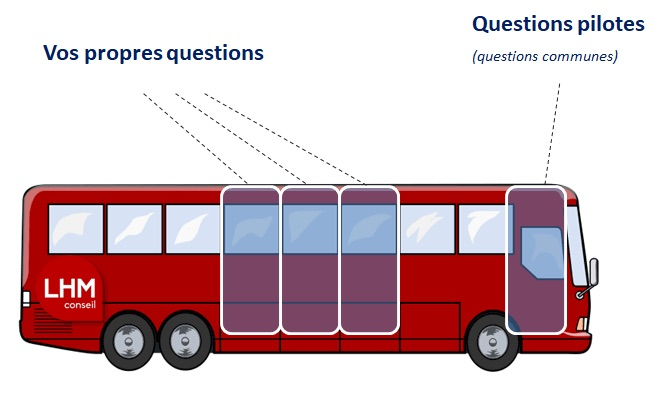
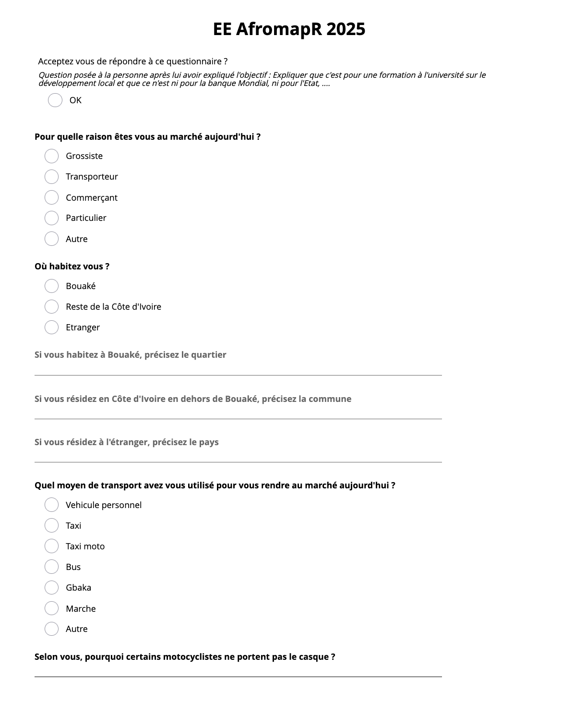
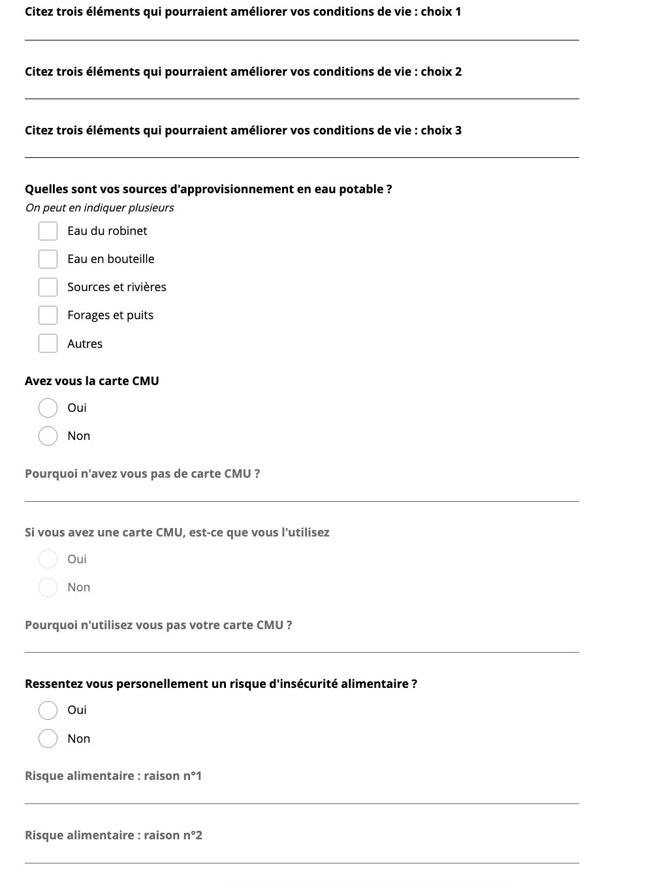
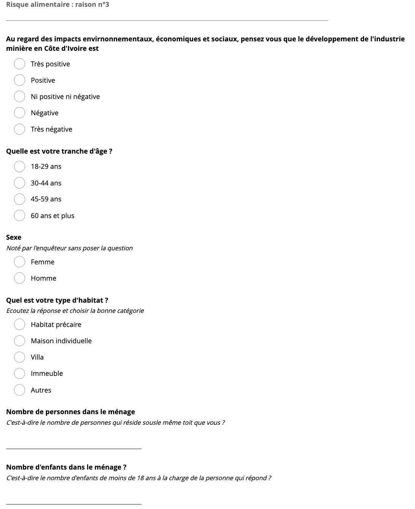
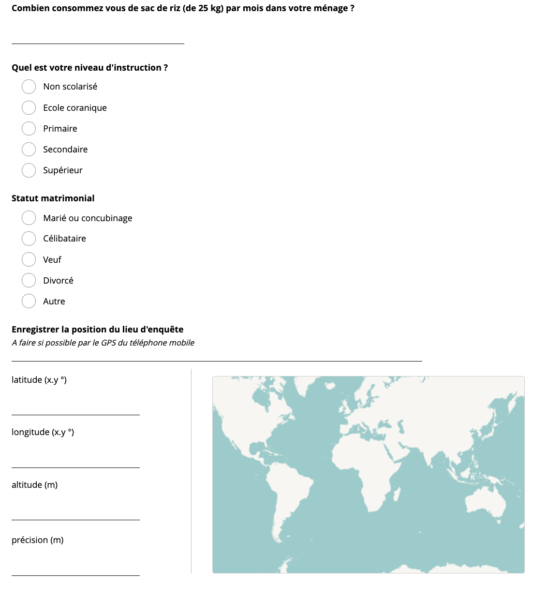

```{r}
library(sf)
library(mapview)
library(htmltools)
library(RColorBrewer)
library(knitr)
map<-st_read("data/Marché_Bouaké/geom/EE_AfromapR_2025_brut.geojson",quiet = TRUE)
don <- read.csv2("data/Marché_Bouaké/data/data_clean.csv",stringsAsFactors = T)
```


# OBJECTIF ET REALISATION

## Objectif

L'idée initiale de l'enquête était d'apprendre aux auditeurs qui ne maîtrisait pas encore cet outil à utiliser Kobo Toolbox. Mais un second objectif était de fournir une base de données qui permettrait à chaque atelier thématique de proposer au moins une question qui serait ensuite posée par tous les autres groupes et que l'on pourrait croiser avec un talon commun. Il s'agissait en d'autres termes de pratique la méthoe de l'enquête omnibus.


{width=400}


## Questionnaire Kobo


L'enquête a été préparée collectivement par les auditeurs et les formateurs puis mise en ligne sur KoboToolbox. Elle comportait en tout 31 questions qui devaient être administées en face à face.


{width=600}

{width=600}

{width=600}

{width=600}


## Lieu de collecte

L'enquête a été effectué le 2 juillet 2025 par les auditeurs de l'école d'été AfromapR 2025. Grâce aux contacts établis par les formateurs, notamment le docteur Bamba Vakaramaoko, nous avons été reçu par l'équipe de direction du marché de Bouaké qui nous a présénté ses origines et son organisation. Puis nous a autorisé à parcourir le marché pour administrer le questionnaire auprès des personnes présentés.

Les auditeurs qui étaient organisés en sept ateliers ont recueilli 115 questionnaires dont 98 ont été géolocalisés ce qui permet de voir qu'un relativement bon échantillonage spatial a été produit 

```{r,}

names(map)[32]<-"Atelier"
map$Atelier<-as.factor(map$Atelier)
levels(map$Atelier) <- c("1.Agriculture","2.Démographie","3.Eau","4.Mines","5.Santé","6.Urbanisation","7.Transport","Formateurs")
map$Atelier[is.na(map$Atelier)]<-"Formateurs"
#display.brewer.all()
mypal<-brewer.pal(8,"Set1")
mapview(map, zcol="Atelier",col.regions=mypal)
```

## Durée des entretiens

Bien que la mesure ne soit pas totalement fiable, ni systématique, on peut estimer le temps moyen des entretiens en comparant le moment où ils ont débuté et celui où il sont été validés.

```{r}
hist(don$duree, 
     col="lightyellow",
     main= "Durée des entretiens",
     ylab = "probabilité",
     xlab = "en minutes",
     xlim = c(0,36),
     breaks = c(2,5,10,15,20,25,30,35,60))
lines(density(don$duree, na.rm=T, bw=3),col="red",lwd=2)
rug(don$duree, col="blue",lwd=3)
summary(don$duree)
```

- **Commentaire** : La durée moyenne des entetiens a été de 13 minutes avec une médiane de 11 minutes et demi. La moitié des entretiens ont duré de 7 à 16 minutes. Cette durée étatit assez variable selon les groupes d'auditeurs :

```{r}
don$groupe2<-paste0(substr(as.character(don$groupe),1,6),".")
boxplot(don$duree~don$groupe2, 
        main = "Durée des entretiens selon les groupes",
        ylim=c(0,36),
        xlab = "en minutes",
        ylab = "",
        horizontal=T, 
        las=2,
        col=mypal)
```


# DONNEES DE CADRAGE (Talon)

Nous présentons ici rapidement les principales données de cadrage qui avaient été choisies par les auditeurs des différents groupes pour consituer le talon du questionnaire.

## Sexe

```{r}
tab<-table(don$sexe)
pie(tab, 
    main = "Sexe", 
    sub= "Enquête AfroMapR, Marché de Bouaké, 02-07-2025",
    col=c("pink","lightblue"))
kable(round(100*addmargins(prop.table(tab)),1),
      col.names=c("Modalité","Fréquence (%)"))
```

- **Commentaire** : Les femmes représentaien environ un quart de l'échantillon

## Âge

```{r}
tab<-table(don$age)
barplot(tab, 
    main = "Age", 
    xlab= "Effectif",
    sub= "Enquête AfroMapR, Marché de Bouaké, 02-07-2025",
    col=c("lightyellow","orange","brown"))
kable(round(100*addmargins(prop.table(tab)),1),
      col.names=c("Modalité","Fréquence (%)"))
```

- **Commentaire** : La classe la plus nombreuse était celle des 30-44 ans, suivie de celle des 45 ans et plus. 

## Raison de la présence sur le marché

```{r}
tab<-table(don$raison)
barplot(tab, horiz = TRUE,
    main = "Raison de la présence sur le marché", 
    xlab= "Effectif",
    sub= "Enquête AfroMapR, Marché de Bouaké, 02-07-2025",
    col=rainbow(7), cex.names = 0.7,
    las=2)
kable(round(100*addmargins(prop.table(tab)),1),
      col.names=c("Modalité","Fréquence (%)"))
```

- **Commentaire** : Les personnes interrogées étaient principalement des commerçants (38.3%) et des grossistes (29.6%). On trouvait ensuite des particuliers (12.2%) et des transporteurs (9.6%).


## Niveau d'instruction


```{r}
tab<-table(don$instr)
barplot(tab, horiz = TRUE,
    main = "Niveau d'instruction déclaré", 
    xlab= "Effectif",
    sub= "Enquête AfroMapR, Marché de Bouaké, 02-07-2025",
    col=rainbow(7), cex.names = 0.7,
    las=2)
kable(round(100*addmargins(prop.table(tab)),1),
      col.names=c("Modalité","Fréquence (%)"))
```

- **Commentaire** : Les personnes enquêtées avaient le plus souvent un niveau d'instruction primaire (27%) ou secondaire (28%). Venaient ensuite les personnes n'ayant pas suivi d'enseignement (21%) ou ayant suivi une école coranique (17.5%). Très peu avaient fait des études supérieures (6%)

## Type d'habitat

```{r}
don$habitat<-relevel(don$habitat,ref="Précaire")
tab<-table(don$habitat)
barplot(tab, horiz = TRUE,
    main = "Type d'habitat", 
    xlab= "Effectif",
    sub= "Enquête AfroMapR, Marché de Bouaké, 02-07-2025",
    col=rainbow(7), cex.names = 0.7,
    las=2)
kable(round(100*addmargins(prop.table(tab)),1),
      col.names=c("Modalité","Fréquence (%)"))
```

- **Commentaire** : Cette variable était un proxy indirect du niveau de richesse. Mais elle s'avère peu efficace puisque la majorité des personnes (61%) résident dans des maisons. 


## Statut matrimonial

```{r}

tab<-table(don$statut)
barplot(tab, horiz = TRUE,
    main = "Statut matrimonial", 
    xlab= "Effectif",
    sub= "Enquête AfroMapR, Marché de Bouaké, 02-07-2025",
    col=rainbow(7), cex.names = 0.7)
kable(round(100*addmargins(prop.table(tab)),1),
      col.names=c("Modalité","Fréquence (%)"))
```

- **Commentaire** : Plus de trois quart des personnes enquêtées étaient mariées ou vivaient en concubinage (79%). 18% étaient célibataires et 2.6% divorcés. 

## Taille des ménages

```{r}
hist(don$tailmen, 
     col="lightyellow",
     main= "Taille des ménages",
     ylab = "probabilité",
     xlab = "nombre de personnes",
     xlim = c(0,40),
     breaks = c(0,2,4,6,8,10,14,18,22,26,30,32,36,40,50))
lines(density(don$tailmen, na.rm=T, bw=2),col="red",lwd=2)
summary(don$tailmen)
```

- **Commentaire** : La majorité des personnes étant mariées et relativement âgées, on trouve des tailles de ménages importantes avec une moyenne de 10 personnes et une médiane de 8 personnes. 

## Nombre d'enfants par ménage

```{r}
hist(don$enfmen, 
     col="lightyellow",
     main= "Nombre d'enfants par ménage",
     ylab = "probabilité",
     xlab = "nombre de personnes",
     xlim = c(0,20),
     breaks = c(0,1,2,3,4,5,6,7,8,9,10,12,14,16,20,25))
lines(density(don$enfmen, na.rm=T, bw=2),col="red",lwd=2)
summary(don$enfmen)
```

- **Commentaire** : Les personnes enquêtées ont déclaré avoir en moyenne 5.6 enfants avec une médiane de 4 enfants.La moitié des personnes interrogées avait de 2 à 8 enfants. 


